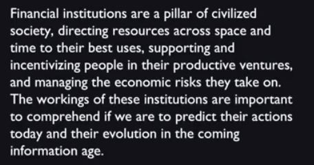
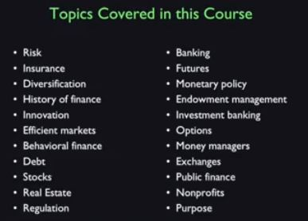

Making things happen is what I think finance ought to be about.

# Financial Markets
Market suggests that the course is about trading.

If you make a lot of money in finance, it's a game, you enjoyed it, now give most of it away – that's going to be a theme.