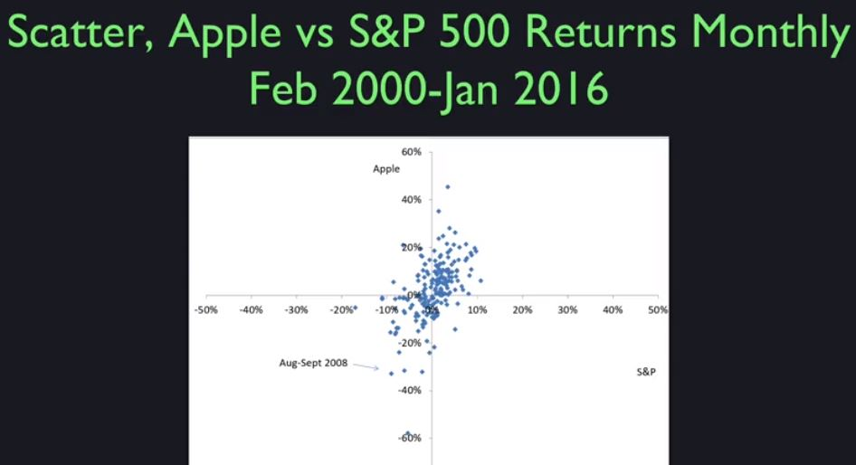
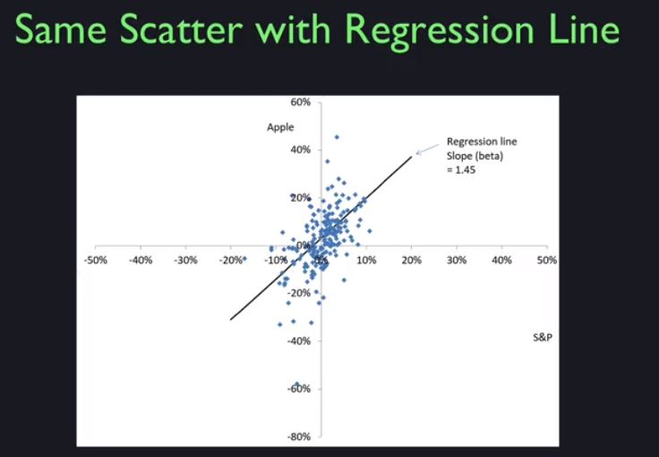
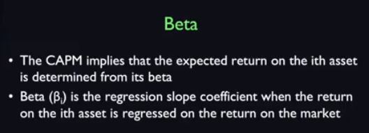
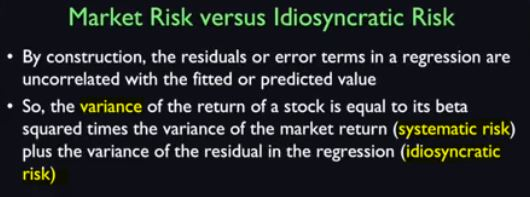

This is a scatter diagram showing the returns on the S&P 500 on the horizontal axis and the returns on Apple on the vertical axis.

And you can see that the scatter has an **upward slope** to it which means **they are correlated**.

It's not that strong an upward slope, but when S&P is high, Apple tends to be high in return and when the S&P is low, Apple tends to be low.

Apple axis goes from +60 to -80. And on S$P axis I have -50 to +50. So Apple is more variable than S&P 500. But you can see that there is a correlation.

Actually it's better if I put a regression line in. This is a line fitted through the scatter points.

it has a slope(**Beta**) of **1.45** which is greater than one, which means that Apple overreacts to what happens in the aggregate stock market. 

And then it has noise on top of that. Apple noise, like Steve Jobs death noise that doesn't affect the overall stock market.

## Beta

* The Beta of a stock is a meansure of how it relates to the stock market.
 - If the beta is **1**, then the asset tends to go up and down one for one in terms of returns with the aggregate market. If the beta is **2**, well, they're kind of rare to see beta two stocks. Beta **1.45** is getting high. So the Apple reacts more than directly to the stock market. So when times are good, people think they are really good for Apple. And when times are bad they think it's really bad for Apple.

## Market Risk vs Idiosyncratic Risk
* Market Risk is the risk of the **whole stock market**
 - And for an Apple investment, the market risk of that investment is the risk that Apple will do something in reaction to the aggregate stock market.
* Idiosyncratic risk is an **Apply only** risk

Remember the equation for a line in algebra class. y = mx+ B. 

In finance we call y as the return on Apple stock, x as the return on the market, slope m as beta, and the constant B is Alpha. Slope beta tells how much a particular stock co-moves with the market and thus as a measure of the stock systematic risk. 

So the idiosyncratic risk is the risk that the point will lie above or below that line. And you can see, there's a lot of idiosyncratic risk for Apple.

