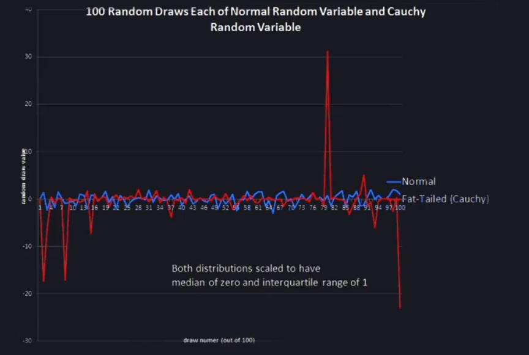

Many random variables in nature follow this distribution but not all of them and that's important because in finance it tends **NOT** to follow this distribution, that we tend to have outliers or fat tails

## Cauchy distribution

100 draws from the normal distribution in blue, and 100 draws from the Cauchy distribution in red

* The probability that it will be 10 times the normal change, the usual change is negligible so you never see it deviating. It has the kind of uniform look to it through time
* but with Cauchy, it also looks very much like normal. You can't even tell them apart for long intervals of time and then bang! there's some big positive value. 

In other words, the distribution under Cauchy is **fat tailed** so the Cauchy looks like a normal distribution instead of just trailing off to zero, the distribution continues out above zero, **way out**. 

So, you can be deceived by a fat tailed distribution like the Cauchy into thinking that you're living in a fairly stable world whose risk I understand, but the problem is, there are these big events that occur from time to time.

----

The Cauchy distribution looks pretty much like the normal. It's a bell-shaped curve and it trails off but there's a subtle difference, that there are these rare very... they're not quite as rare as as the normal would suggest. The real world puts fat tails in our lives.

----
## What a history

----
## Outliers
* Normal distribution with the same mean and standard deviation as this histogram says that the probability of a drop greater than 20% is equal to 3*10^-71.