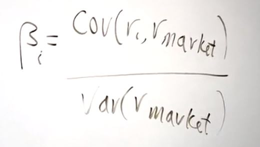

# This is the basic bottom lesson. 

* **Risk is determined by covariance.** Especially if you hold a large number of assets. 
* Idiosyncratic risk just doesn't matter. It all averages out. 

It's actually the covariance of a stock with, let's say the broader market. >> Well yeah, because any investor has the option of investing in everything. >> Right. >> Because there are mutual funds hat will do, there are world funds that **put their money all over the world** And so, why shouldn't you do that? It sounds like it's a pretty good thing to do actually.

----
But the one thing they can **NOT** get rid of is the market risk for the whole world.

That's there, because if you hold the whole world, you're still subject to the world's risk. But that's what an investor needs to be focused on, and this is a **bad habit** among many individual investors. They **just look at one stock** and they think, I'm going to put all my money in that. >> Right. >> And they just don't consider how many different options for risk spreading they have in this vast world that we have around us.

----
## Beta is a scaled covariance

* In fact the beta of the i stock is its covariance with the market divided by the variance of the return on the market.

* And the average beta has to be one, because I could substitute the average return on the assets. And that's the return of the market, so then the covariance of anything with itself is equal to the variance. It just equals one.

* In other words, the basic says, that the market demands higher returns from higher beta stock. That means high covariance with the market stock. And they're willing to take no returns if the beta is low, because that means it's less contributing to risk in the portfolio.

* In fact, if you can find a negative betta stock, or lets say goals, it may not always be negative data. But lets say in theory it is negative beta. Putting gold into your portfolio, it has no return at all. It doesn't pay dividends, nothing. But it moves opposite your other investments. That's the theory.

----
The CAPM model is an abstraction, an idealization. And it assumes that there are well-defined probabilities for everything.

But in fact, I don't think anyone behaves entirely in accordance with this model. I'm thinking of it as, it's actually a fabulous model as a first step in thinking about financial markets. Because it can prevent you from making a lot of mistakes.