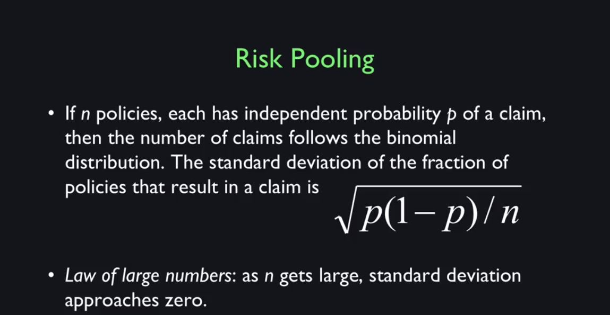

# Insurance

The policyholders have a contract with the insurance company to protect them against certain well-defined risks and for that they pay a premium, a regular payment to the insurance company for its standing ready to manage those risks. 

----
## Fundamental Insurance Principles and Issues
* **Risk Pooling** is the source of all value in insurance
 - A risk for one person is not a risk for society at large if they are independent. Because by the Law of Large Numbers, the number of bad outcomes are fairly predictable. The insurance company pools all these risks, and by the Law of Large Numbers is not really risky in itself.

----

* Assuming independence, let's say it's a life insurance: If every death is independent of the other, there's no epidemics or wars that bring a lot of deaths all at once. Then the risk that you face if you're writing any policies each against one life is, the standard deviation is given by the √p(1-p)/n, where p, is the probability of death.
* The fraction of policies that result in death becomes practically unknown number.

> According to the Law of Large Numbers, the average of the results obtained from a large number of trials should be close to the expected value and will tend to become closer as more trials are performed. The Law of Large Numbers is important because it guarantees stable long-term results for the averages of some random events. So, let's take an example. While a casino may lose money in a single spin of the roulette wheel, its earnings will tend towards a predictable percentage over a large number of spins. That's how the casino can confidently pay its monthly bills. Another example would be, if we took a six-sided dice and rolled it many times, the average of their values sometimes called the sample mean is likely to be close to 3.5 with the precision increasing as more dice are rolled.

----
Unfortunately, it's not so easy to make this idea work in practice, largely because of **moral hazard and selection bias**.

## Fundamental Insurance Principles and Issues
* **Moral Hazard** dealt with partially by deductions and co-insurance
 - Moral hazard occurs when people knowing they are insured take more risks.
 - So for example, if your house is insured against fire you may say, "I don't care, I'll be careless with fire because it's insured." So then the risk goes up. 
 - Or even worse, if the insurance company insures your house for more than you think you can sell it, you would say, "I'll just burn it down and pretend it was an accident. And then I'll get more money than I would have for selling the house." 
* **Selection Bias** dealt with by group policies, by testing and referrals, and by mandatory government insurance
 - It is that, the insurance company may not be able to see all of the risk parameters that define risk then their customers may see them more.
 - So for example, health insurance tends to attract sick people. So health insurance companies ask for a medical exam, traditionally, to screen out people who know they're already going to be sick. If they're not successful in doing that, then the selection bias can harm their business and it can destroy an insurance business because, if people know that they're going to be sick, then only sick people sign up. The insurance has to be expensive. Healthy people won't sign up because they don't want to pay the expense and so the whole thing collapses and doesn't work. So you have to deal with selection bias the best you can by exams and disclosure and also by mandatory. 
 - The government can make it mandatory that insurance companies do not look at the selection. Obamacare is known for that, that health insurance companies are not allowed to take preexisting conditions into account.

----
# Example of farmer insurance
Let me give you an example of moral hazard and selection bias in insurance. Many people in this world today are living in marginal economies, subsistence farmers. You have a farm in some very underdeveloped part of the world and you depend on the crop every year to feed your family. But unfortunately, the weather throws up those curveballs every now and then. There will be a typhoon or there will be a drought of some sort. So farmers should buy insurance, right? But, how do we do that? One kind of insurance that's been offered for many centuries, I suppose, is crop insurance. So the farmer buys insurance against the crop failing. That sounds good and workable. There's a problem with it though. The problem is that it's subject to manipulation. The farmer can lie about the crop, right? He can say, "I didn't get much of a yield this year." He can sneak some of it off and sell it and then try to claim on the insurance. Or the farmer can just get careless. Maybe he's just not that focused guy, right. He doesn't do things right. He gets drunk and he doesn't do the necessary thing. That's a moral hazard. And then there is selection bias. Farmers who know that they're living on marginal land will be the ones who will go for the insurance. So, crop insurance has been around but it hasn't worked that well. This leads to an advance that occurred in the last 20 years or so as pushed by the World Bank, which is an international development institution. How about insuring the weather instead of the crop? Okay, because the farmer can't cheat on the weather. He can't make bad weather. We have weather stations. So that sounds like a good idea? Well it's a new idea. Weather insurance for farmers. And it's starting to catch on especially in the developing world where it's extremely important. It can be life or death for some of these farmers. But then, does that sound obvious and workable? Can you think of any problems with weather insurance? You have to define the weather very carefully if you're going to describe the effect on crops. It turns out that, if you plant seeds on a certain date and they start germinating they're very vulnerable to drought. After a certain number of days after planting and if the bad weather comes right then, so you have to measure it locally and know exactly when the planting was, details like that to make it work.

----
The reason we want insurance as opposed to gift giving is because insurance is much more logical and priced out so we know exactly what cost and what you can expect.