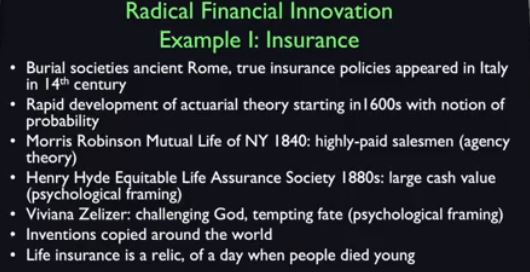

## History of Insurance
* The concept of insurance, as we pointed out, goes back to ancient Rome but it doesn't seem to have taken over. It wasn't managing most risk. It was a narrow scope of risk.
* If you look at the history of insurance, insurance developed because of specific technical advances like the development of **actuarial theory**.
* it was in the 1600's that they produced the first life tables. And what they were, it showed the probability of dying at each age. That's what you need to know if you're doing a life insurance policy. What is the probability that the insured will die? And they didn't, nobody had any statistics anywhere in the world on that until the 1600's.
* insurance wasn't widely accepted. The people mistrusted it and didn't understand it.

----
## Marketing inventions

----
True or False: The McCarran-Ferguson Act of 1945 reduced the complexity of the insurance industry by consolidating regulation at the federal level.

Answer: False - The McCarran-Ferguson Act of 1945 delegated insurance regulation to the states.